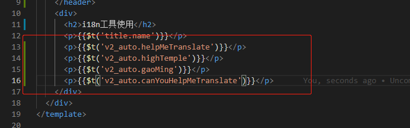
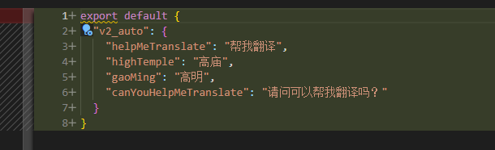

# i18n-tools

## 背景

    大量重复性劳动，手动翻译、替换，在这过程中还容易出错，比如替换错key值。于是就写了这个工具，很大程度上避免了重复性劳动跟很多错误
## 前言

    如果你也想应用到你的项目当中，请注意
    
- 1、项目对国际化翻译的内容要求一般（因为是机翻，会有不完美的地方)
- 2、只需要中英国际化（能力有项，项目暂时也不需要其他语言）

## 功能

- 1、提取翻译项
- 2、爬虫自动翻译or付费翻译方式（是付费google的翻译服务)
- 3、手动修正翻译不完美的地方，更好的国际化
- 4、翻译的内容替换到项目中去，懒人必备

## 准备工作
- 依赖包：got、koa、koa-router、koa-bodyparser以及puppeteer
    ```js
    npm i got koa koa-router koa-bodyparser puppteer -D
    ```

### 启动国际化界面
```js
npm run i18n
```
- 1、正常编码，使用$g自定义函数填入待翻译的项（为了和$t区分开，避免翻车)


- 2、跑完run i18n的命令，应该可以看到这个界面


- 3、点击提取翻译列表，默认会遍历当前src目录下所有的js、vue文件，显示等待翻译的字符串


- 4、执行翻译，一种通过puppeteer去解析Google的翻译，另外一种是通过付费翻译（比较精准），如果是大企业公司的话，建议去google购买翻译服务，拿到个key，在**i18n-server/config/index**中进行替换。


- 5、全局替换，可以自定义生成的文件名称


- 6、替换成功




### 注意事项

- 1、点了执行翻译(爬虫)没有显示，并且接口报错。原因是爬虫的方式不靠谱，解析到的结果跟拿到的结果条数不一致，这个时候只能选择付费翻译or手动填写翻译替换了


### 最后

- 有问题欢迎提issue讨论~
